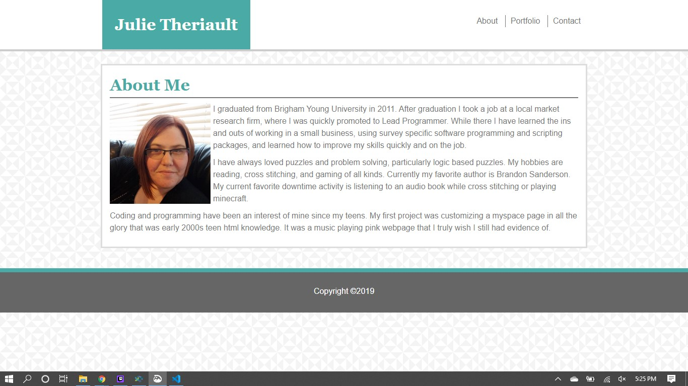
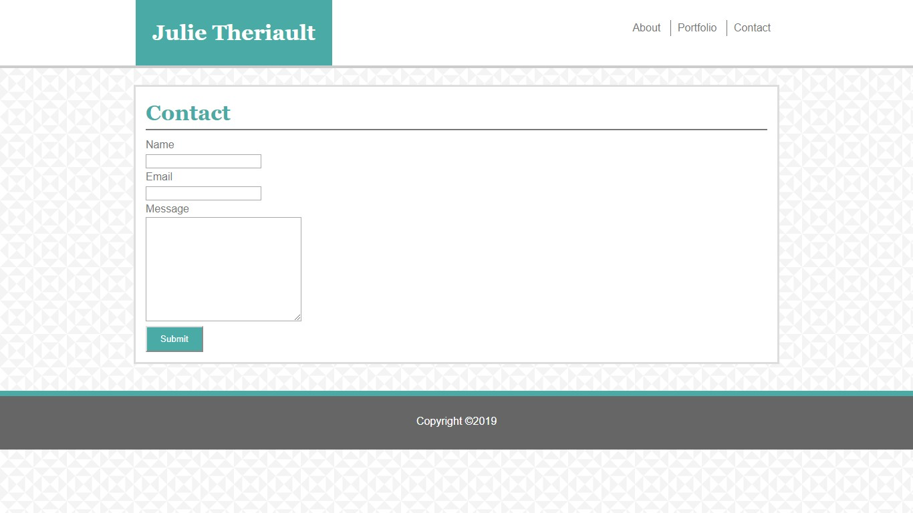
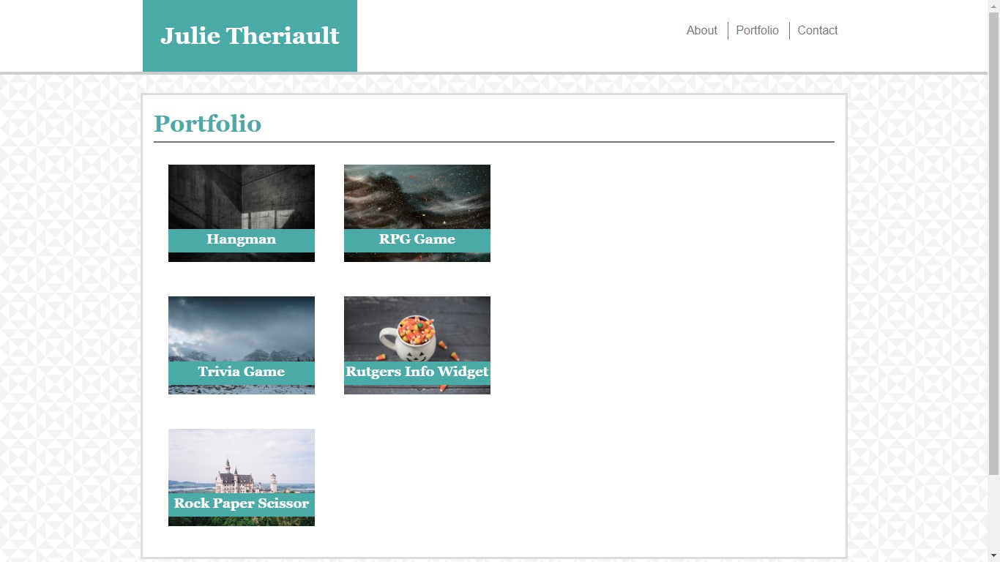

# Static Portfolio

## Description

This project is designed to utilize HTML and a non-responsive CSS structure, in order to demonstrate a basic understanding of the syntax and utilization of the two languages used in most user facing web design.

## Usage

Using the links at the top of each page, navigate to each page in order to explore this site.

### About

This page gives a brief description of me, my professional life, and my hobbies and interests.

### Contact

This is a form built using html to collect any feedback you may have about this site. It is not currently functional.

### Portfolio

This page illustrates a format for showcasing projects. All images and links on this page are placeholders.
